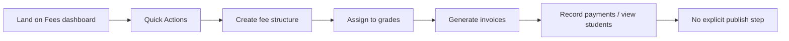

# Fees UX Review

**Audience:** School administrators, bursars, and office staff who are not technical — plus teachers asked to record a payment.  
**Scope:** Admin fees flow from landing on `/fees` through fee setup, assignment, invoicing, payment recording, and ongoing management.  
**Code reference:** `fees/page.tsx` and related components.  
**Last reviewed:** May 2026

---

## Table of contents

1. [Executive summary](#executive-summary)
2. [Journey map](#journey-map)
3. [Chapter 1 — Arriving on the fees page](#chapter-1--arriving-on-the-fees-page)
4. [Chapter 2 — Understanding the dashboard](#chapter-2--understanding-the-dashboard)
5. [Chapter 3 — Creating a fee structure](#chapter-3--creating-a-fee-structure)
6. [Chapter 4 — Assigning fees to classes](#chapter-4--assigning-fees-to-classes)
7. [Chapter 5 — Generating invoices](#chapter-5--generating-invoices)
8. [Chapter 6 — Viewing students and balances](#chapter-6--viewing-students-and-balances)
9. [Chapter 7 — Recording payments](#chapter-7--recording-payments)
10. [Chapter 8 — Editing, fixing, and deleting](#chapter-8--editing-fixing-and-deleting)
11. [Chapter 9 — “Publish” and go-live](#chapter-9--publish-and-go-live)
12. [Chapter 10 — Mobile and small screens](#chapter-10--mobile-and-small-screens)
13. [Chapter 11 — Errors and validation](#chapter-11--errors-and-validation)
14. [Chapter 12 — Visual hierarchy](#chapter-12--visual-hierarchy)
15. [Chapter 13 — Reducing clicks and repetition](#chapter-13--reducing-clicks-and-repetition)
16. [Persona snapshots](#persona-snapshots)
17. [Naming cheat sheet](#naming-cheat-sheet)
18. [Ideal end-to-end journey (target state)](#ideal-end-to-end-journey-target-state)
19. [Priority backlog](#priority-backlog)
20. [Known implementation gaps](#known-implementation-gaps)

---

## Executive summary

The fees area centers on a **Quick Actions dashboard** (`FeesActionDashboard`) with paths to fee structures, invoice generation, assignments, and payments. A **3-step fee structure wizard** (Setup → Amounts → Review) is the real create/edit flow (`FeeStructureWizard`, exported as `FeeStructureDrawer`).

| Strength | Gap |
|----------|-----|
| Clear intended workflow in `WorkflowGuidance` (4 steps) | Guidance only on **structures** sub-view; **not on default dashboard** |
| Wizard steps are relatively short (3 steps) | Jargon: **fee structure**, **buckets**, **bulk** |
| Structure cards with term tabs and totals | **View Invoices** opens a **student list**, not invoices |
| Prerequisites check (year + terms) before create | **Record Payment** from dashboard works without picking a student |
| Assign-to-grade modal with grade list | **Edit fee line items** toast: "Coming Soon" |
| Stats cards with gradient styling | "System Health" reads like a dev monitoring dashboard, not useful for a bursar |
| `WorkflowGuidance` component has nice progress bar | Not interactive — `completedSteps` and `onStepClick` never passed |

**Critical findings:**

1. **No single guided path on first visit** — user lands on stats + quick actions, not "Step 1: Set fees."  
2. **Duplicate / legacy code paths** — `FeeStructureDrawerRefactored` (5 steps), `structures/page.tsx`, `PageHeader`, `StudentSearchBar` are largely **disconnected** from the main page.  
3. **"Publish"** is not explicit — activating structures, generating invoices, and recording payments blur together; no "fees live for parents" moment.
4. **Hardcoded grade assumptions** — wizard Step 1 and `AssignFeeStructureModal` hardcode Kenyan CBC grades (PG, PP1/PP2, G1–G6, F1–F6). Schools with different naming schemes (International, British curriculum) get mismatched grade lists.
5. **No student search on the main dashboard** — `StudentSearchBar` is imported in `page.tsx` but never rendered. A bursar who wants to find a specific student must navigate away from the dashboard.

---

## Journey map



**Views in code (`currentView`):**

| View | How user gets there | What they see |
|------|---------------------|---------------|
| `dashboard` (default) | Open `/fees` | Quick Actions + Overview stats |
| `structures` | Not linked from dashboard UI directly* | `WorkflowGuidance` + `FeeStructureManager` |
| `invoices` | Not obvious from dashboard* | Student fee summary OR all-students table |

\*Dashboard embeds structures/invoices **inside** `FeesActionDashboard` via `showFeeStructuresInDashboard` / `showInvoicesInDashboard`, separate from `currentView`.

---

## Chapter 1 — Arriving on the fees page

### What the user sees

- Full-width gradient background.
- **No main page title** on the default dashboard (unlike “Fee Management” in unused `PageHeader`).
- Left column: **Quick Actions** (6 tiles).
- Right column: **Overview** stat cards (Fee Structures, Students, Invoices, Total Revenue).
- Below: **System Health** (API Online, Payment Processing Active) and **Recent Activity** (“No recent system alerts”).

### What they think

- *“Is this for me or for IT?”* — System Health reads like a dev monitor.
- *“What should I do first?”* — Six equal buttons with no numbered path.
- *“Where do I see who owes money?”* — Not the first thing shown.

### First-impression fixes

| Issue | Recommendation |
|-------|----------------|
| No headline | **School fees** + one line: *Set class fees → bill students → record payments* |
| System Health | Remove from default view or rename **Setup status** (e.g. "Fee plans: 2 · Ready to bill") |
| Six equal actions | Highlight one primary: **Set up fees for this year** |
| No checklist | Reuse `WorkflowGuidance` on dashboard with **live completion** (structures exist? assigned? invoices generated?) |
| No student search | Render `StudentSearchBar` on dashboard for quick lookups |
| "Recent Activity" placeholder | Implement real activity log (e.g. "Fee plan '2025 Day' created 2 days ago", "45 invoices generated for Term 1") or remove section |

---

## Chapter 2 — Understanding the dashboard

### Quick Actions (labels today)

| Button | User mental model | Actual behavior |
|--------|-------------------|-----------------|
| Fee Structures | See fee plans | Expands structures list in dashboard (`FeeStructuresTab`) |
| Create Structure | Start setup | Opens 3-step wizard sheet |
| Generate Invoices | Bill everyone | Opens `BulkInvoiceGenerator` |
| View Invoices | See bills | Opens **`FeesDataTable` (students)** — misleading name |
| Assign Grade | Link fees to classes | Sets `currentView` to `structures` only — **does not open assign modal** |
| Record Payment | Enter a payment | Opens payment drawer **without requiring student selection** |

### Overview stats

| Stat | Risk |
|------|------|
| Fee Structures | Count may not match grouped “plans” user expects |
| Students | OK |
| Invoices | May not reflect real invoice count if data comes from mixed sources |
| Total Revenue | Powerful but undefined (collected? expected?) — needs subtitle |

### Friction

- **Two navigation models:** `currentView` (dashboard / structures / invoices) vs inline `showFeeStructuresInDashboard` / `showInvoicesInDashboard`. Easy to get lost.
- **Back to Overview** only when drilled into structures/invoices inside dashboard — structures **full-page view** uses **← Back to Dashboard** instead.
- **WorkflowGuidance** on `structures` view has **no `completedSteps` or `onStepClick`** passed — decorative only.
- **System Health** reads like an IT dashboard: "Fee Structures API: Online", "Payment Processing: Active", "Invoice Generation: Ready". A bursar doesn't care about API status — they want "Are fees set up?", "Can I bill students?"
- **"6 quick actions available" footer** is static — always says 6 even if some actions aren't relevant to the user's current state.

### Recommendations

- One navigation pattern: tabs **Overview | Fee plans | Students & payments**.
- Rename **View Invoices** → **Student balances** or **Who owes fees**.
- **Assign Grade** → open `AssignFeeStructureModal` or scroll to assign on structure card.
- Wire `WorkflowGuidance` with real progress and click → open the right drawer.
- Replace System Health with **Setup checklist**: "Fee plans: ✓ · Classes assigned: ✓ · Ready to bill".

---

## Chapter 3 — Creating a fee structure

### Entry points

- Quick Action **Create Structure**
- `FeeStructuresTab` → **Create** (disabled until academic year + terms exist)
- `FeeStructureCard` / manager (structures view)
- Empty state CTA

### Active implementation

`FeeStructureDrawer.tsx` re-exports **`FeeStructureWizard`** (3 steps):

| Step | Title | User-facing focus |
|------|--------|-------------------|
| 1 | Setup | Name, boarding type, academic year, grades (hardcoded grade list in step) |
| 2 | Amounts | Fee **buckets**, amounts, mandatory toggles, per-term amounts |
| 3 | Review | Confirm and save |

### Unused / confusing alternate

- **`FeeStructureDrawerRefactored.tsx`** — 5 steps (Basic Info, Grade Selection, Terms Setup, Fee Components, Review). **Not used** by main `page.tsx`.
- **`structures/page.tsx`** — separate route using older `FeeStructureForm` + mock-style hooks.

### Step 1 friction (`Step1QuickSetup`)

| Issue | Detail |
|-------|--------|
| **Fee structure name** | Jargon — prefer **Fee plan name** (e.g. “2025 Day scholars”) |
| **Boarding type** | day / boarding / both — OK with short explanations |
| **Grades** | Hardcoded `'Grade 1'…'Form 4'` — may not match school’s real grades from config. `AssignFeeStructureModal` uses its own `abbreviateGradeName` (G1, F1, PP1) that assumes Kenyan CBC curriculum. Schools with different systems (British Year 7, American Grade 10) get wrong abbreviations. |
| **Academic year** | Loaded from API — good; terms auto-filled — good |
| **No grade data from school config** | Wizard doesn't use school config to pull actual grade levels. Hardcoded list means some schools see grades they don't use, and miss grades they do. |

### Step 2 friction (`Step2Amounts`)

| Issue | Detail |
|-------|--------|
| **Buckets** | Core jargon — use **Fee items** or **Charges** (Tuition, Lunch, Activity) |
| **Mandatory switch** | OK — label **Required fee** |
| **Per-term amounts** | Powerful but easy to miss — explain *“Amount can differ per term”* |
| **Add bucket** | Modal — good; keep names in plain English |
| **No due date per term** | User sets amounts but can't set *when* payment is due. Critical for invoicing — due dates are only set at invoice generation time, not at the fee plan level. |
| **No "copy across terms" button** | If Term 1–3 have the same amounts, user must enter them three times. Add **"Copy Term 1 amounts to all terms"**. |

### Step 3 — after save

- Success depends on `handleSaveStructure` in `page.tsx` (GraphQL create/update).
- User should see: **“Fee plan saved. Next: assign it to classes.”** with button **Assign to grades**.

### Prerequisites (`FeeStructuresTab`)

- Create disabled until **academic year** and **at least one term** exist — good.
- Empty state should say **how** to add year/term (link to same modals as timetable).

---

## Chapter 4 — Assigning fees to classes

### Flow

1. From structure card → **Assign** (or Quick Action intended to).
2. `AssignFeeStructureModal` — pick grade levels (abbreviated **G1**, **F1**, **PP1**), optional description, submit.

### Friction

| Issue | Impact |
|-------|--------|
| Abbreviations on grades | Bursar may not recognize **F1** vs **Form 1** |
| “Assign Grade” quick action | Only switches view — **feels broken** |
| No preview | User doesn’t see *“Grade 5 will owe KES X per term”* before confirm |
| Assignment vs structure | Two concepts: **fee plan** and **which classes use it** — needs one sentence in modal |

### Copy

| Current | Suggested |
|---------|-----------|
| Assign to Grades | **Apply this fee plan to classes** |
| Fee structure | **Fee plan** |
| Grade levels | **Classes / grades** |
| G1, F1, PP1 (abbreviations) | **Grade 1, Form 1, Pre-Primary 1** (full names with abbreviations as secondary) |

---

## Chapter 5 — Generating invoices

### Entry points

- **Generate Invoices** (dashboard) — bulk generator, no structure pre-selected.
- Structure card → generate for a **term**.
- `handleBulkGeneration` → `generateBulkInvoices` from `useFeeStructures` (may differ from GraphQL invoice APIs).

### User expectation

> “I clicked Generate Invoices — parents will get bills.”

### Friction

| Issue | Detail |
|-------|--------|
| **Bulk** in component name | Say **Create student bills** or **Bill students for Term 1** |
| Progress UI | Exists in generator — good; explain *how many students* |
| After generate | Toast + `setCurrentView("invoices")` but invoices view may not list new invoices clearly |
| Pre-requisites | User may skip **assign to grades** — need validation message |

### Recommendations

- Wizard step 3 of 4 on dashboard: **Create bills for [Term]** with checklist (plan assigned? X students).
- Confirm: **“Create 240 invoices for Term 1?”**
- Link to **download / send** (future) after generation.

---

## Chapter 6 — Viewing students and balances

### “View Invoices” path

Opens `FeesDataTable` with **all students summary** — not a list of invoice documents.

### Student detail path

- Row click → `StudentDetailsDrawer` with fee summary, invoices table, payment history.
- `currentView === "invoices"` + `selectedStudent` shows `FeeSummaryCard`, `StudentInvoicesTable`, `StudentPayments`.

### Friction

| Issue | Detail |
|-------|--------|
| Misleading **View Invoices** | Rename; add column **Balance due**, **Status** |
| Unused `StudentSearchBar` import | Suggests search was planned — users expect search on main fees page |
| `PageHeader` not rendered | Lost filters, reminders, “New invoice” prominence |
| Invoice details modal | **Download PDF** button — likely **no implementation** on main page |
| Filters in invoices view | `FiltersSection` wired with **no-op** `setSelectedClass` / `setDueDateFilter` |

### Recommendations

- Default landing option: **Balances** table (student, class, owed, paid, status).
- Search by name or admission # at top.
- Invoice row → view PDF / print / send reminder.

---

## Chapter 7 — Recording payments

### Flow

1. **Record Payment** from Quick Actions.
2. `RecordPaymentDrawer` — select invoice, amount, method (MPESA, Cash, Bank…), date, reference.

### Friction

| Issue | Detail |
|-------|--------|
| No student pre-selected from dashboard | Invoice dropdown empty or confusing — **select student first** |
| Silent validation | `handleSubmitPayment` warns in console if fields missing — user sees nothing |
| `onViewPayments` | Same handler as **View Invoices** — duplicate/wrong |
| Methods | MPESA uppercase vs cash lowercase — minor inconsistency. Standardize: all same case. |
| Reference field | User must manually enter a reference — no auto-generation (e.g., "PAY-2026-0042") |
| Post-payment refresh | Payment triggers refetch but no visible confirmation that the balance updated — user may think nothing happened |

### Ideal flow

1. From student row → **Record payment** (student pre-filled).
2. Or dashboard → **Record payment** → **Find student** step first.
3. Show **balance after payment** on success.

### Copy

| Current | Suggested |
|---------|-----------|
| Record Payment | **Record a payment** |
| Invoice | **Bill / invoice** |
| Partial payment | **Part payment** (with hint) |

---

## Chapter 8 — Editing, fixing, and deleting

### Edit fee structure

- Opens same 3-step wizard in edit mode with loaded GraphQL/processed data.
- Complex grouping in `processedFeeStructures` (merge by name + year, strip “ - Term X”) — **user may see one card but multiple backend structures**.

### Edit line items on card

- `handleUpdateFeeItem` → toast **“Coming Soon”** — user tries to fix tuition amount on card and fails.

### Delete

- Delete with guards against duplicate requests — good.
- Confirm dialog should name **plan**, **year**, and **whether invoices exist**.

### PDF preview

- `FeeStructureCard` → PDF preview — good for bursar; label **Preview fee letter** not technical “PDF”.

---

## Chapter 9 — “Publish” and go-live

### User expectation

1. Set fees (draft)  
2. Review  
3. **Publish** / **Activate** for term  
4. Then bill parents  

### Current behavior

- **`isActive`** on structures — exists in filters/cards but not explained as “live for billing.”
- Generating invoices acts as informal go-live.
- No banner: *“Parents do not see fees until invoices are sent.”* (if true)

### Recommendations

| Status | Meaning for user |
|--------|----------------|
| Draft | Editing amounts; not billed |
| Active | Ready to assign and bill |
| Closed | Term ended; no new invoices |

**Button:** **Activate fee plan for [Term 1]** after review.  
Until built: **"Students are billed when you create invoices."**

**Additional recommendation:** Add a banner/indicator visible to admins and (future) parents:
> Parents see fees once invoices are created. No changes are visible until then.

---

## Chapter 10 — Mobile and small screens

| Area | Issue |
|------|--------|
| Quick Actions grid | 2 columns — OK; labels may wrap |
| Stat cards | 2×2 grid — OK |
| Fee structure wizard sheet | `sm:max-w-2xl` — OK |
| `FeeStructuresTab` filters | Cramped on phone — stack vertically (partially done) |
| Structure cards | Many buttons (Edit, Assign, Generate, Delete, PDF) — need priority + overflow menu |
| Tables | `FeesDataTable` horizontal scroll expected |
| Drawers | Payment/invoice drawers — OK |

**Touch:** Ensure card actions are not hover-only.

---

## Chapter 11 — Errors and validation

### Good

- Structure load error with **Retry** in `FeeStructuresTab`.
- Create disabled with prerequisites.
- Wizard field errors via `errors` object.
- Delete/toast on save failure with message.

### Bad

| Example | Problem |
|---------|---------|
| `console.log` / debug blocks in `page.tsx` | Noise; some errors only in console |
| Missing payment fields | Console warn only |
| GraphQL errors | May surface raw message in toast |
| “Coming Soon” on edit item | Feels broken, not “planned” |

### Rule

> **What happened** + **what to do** (e.g. “Add Term 1 in School year settings, then try again.”)

---

## Chapter 12 — Visual hierarchy

### Feels overwhelming

- Six quick actions + four stats + system health + activity + optional embedded structures list.
- Technical labels: structures, buckets, bulk, GraphQL grouping.
- Multiple legacy components in folder (drawer 5-step, forms, guides) increase maintainer confusion — users feel inconsistency.
- **System Health section** reads like an IT monitoring dashboard: "Fee Structures API: Online", "Payment Processing: Active". A bursar doesn't care about API status — they want "Are fees set up?", "Can I bill students?"
- **"Recent Activity" shows "No recent system alerts"** — a placeholder with no real data. Either implement real activity ("Fee plan '2025 Day' created 2 days ago", "45 invoices generated for Term 1") or remove the section.
- **"6 quick actions available" footer** is static — always says 6 even if some actions aren't relevant.

### Feels simple when

- Creating first fee plan in wizard with 3 steps.
- Recording payment for one known student with one invoice selected.

### Target layout

```
School fees · 2025–2026 · Term 1

[●──○──○──○] 1. Fee plan  2. Apply to classes  3. Bill students  4. Track payments

[ + Create fee plan ]     [ Search student... ]

┌─ Balances ─────────────────────────────────┐
│  Student    Class    Owed      Paid   Status │
└──────────────────────────────────────────────┘

⋯ Advanced · Export · System status
```

---

## Chapter 13 — Reducing clicks and repetition

| Task today | Pain | Shortcut |
|------------|------|----------|
| Set same fees all terms | Per-term entry | **Copy Term 1 amounts to all terms** |
| Assign many grades | One modal | **Select all primary** |
| Bill whole school | Bulk generator | Default **all assigned students** with count |
| Record payment | Dashboard → empty drawer | **Record** on student row |
| Fix tuition amount | Coming Soon | Enable inline edit or **Edit plan** |
| Switch year/term | Filter on structures only | Global **Term** in header (like timetable) |
| Find a specific student | Must open invoices view then search | **Search student** bar on dashboard (already imported, not rendered) |
| See what changed recently | No activity log | Real recent activity: "Fee plan updated", "45 invoices generated" |

---

## Persona snapshots

### School bursar (not tech-savvy)

Opens Fees → sees “System Health: API Online” → confused. Clicks **View Invoices** → sees student names, not invoices. Tries to change tuition on card → **Coming Soon**.

### Office admin (first term on system)

Creates fee plan in wizard — goes well. Doesn’t assign to grades. Generates invoices → errors or wrong amounts. No checklist told her assignment was missing.

### Teacher told “record this payment”

Clicks **Record Payment** from dashboard → no student selected → stuck at empty invoice list.

---

## Naming cheat sheet

### Page and navigation

| Current | Suggested |
|---------|-----------|
| Fee Structures (quick action) | **Fee plans** |
| Create Structure | **Create fee plan** |
| Generate Invoices | **Bill students** / **Create bills** |
| View Invoices | **Student balances** |
| Assign Grade | **Apply to classes** |
| Record Payment | **Record a payment** |
| Back to Dashboard | **Back to overview** |

### Wizard and data model

| Technical | Plain language |
|-----------|----------------|
| Fee structure | Fee plan |
| Fee bucket | Fee item / Charge type |
| Bulk invoice generation | Bill many students at once |
| GraphQL structure / processed group | (hide from UI) |
| Boarding type | Day scholar / Boarder / Both |
| Mandatory bucket | Required charge |
| Term structure | **Term 1 fees** (amounts + due date) |
| Active / inactive | **In use** / **Archived** |

### Stats

| Current | Suggested |
|---------|-----------|
| Total Revenue | **Total collected** (with period) |
| Invoices | **Bills issued** or **Open bills** |

---

## Ideal end-to-end journey (target state)

1. **Land** — “Set up school fees for 2025.” Progress: 0/4.  
2. **School year & terms** — if missing, inline setup.  
3. **Create fee plan** — name, classes, charges, amounts per term, due dates.  
4. **Apply to classes** — who pays this plan.  
5. **Review** — table: class × total per term.  
6. **Activate** — plan is live for billing.  
7. **Bill students** — pick term → confirm count → create bills.  
8. **Collect** — balances list → record payment → receipt.  
9. **Remind** — overdue → send reminder (when built).

---

## Priority backlog

### P0 — Trust and clarity

| # | Item |
|---|------|
| 1 | Rename **View Invoices** → balances; fix **Assign Grade** quick action |
| 2 | **Record payment**: require student first or picker step |
| 3 | Show **WorkflowGuidance** on dashboard with real `completedSteps` |
| 4 | Remove or repurpose **System Health** for end users |
| 5 | Payment submit validation → user-visible toasts |

### P1 — Guided setup

| # | Item |
|---|------|
| 6 | Page title + one-line purpose |
| 7 | Post-create CTA: **Apply to classes** |
| 8 | Replace **bucket** copy with **fee items** in wizard |
| 9 | Use school **grade levels from API** in Step 1, not hardcoded list |
| 10 | Enable fee item edit or hide controls that show “Coming Soon” |

### P2 — Consolidation

| # | Item |
|---|------|
| 11 | Single navigation (remove duplicate `currentView` vs embedded panels) |
| 12 | Deprecate or redirect `structures/page.tsx` and unused `PageHeader` / `StudentSearchBar` |
| 13 | Document which drawer is canonical (3-step wizard only) |
| 14 | Invoice PDF download — implement or remove button |
| 15 | Wire filters on invoices view |

### P3 — Publish and polish

| # | Item |
|---|------|
| 16 | Draft / Active / Closed status on fee plans |
| 17 | Copy amounts across terms |
| 18 | Parent-facing “fees published” messaging |
| 19 | Reminders and payment plans (hooks exist partially) |

---

## Known implementation gaps

| Item | Location / notes |
|------|----------------|
| `WorkflowGuidance` not on dashboard | Only `currentView === "structures"` in `page.tsx` |
| `WorkflowGuidance` not interactive | No `completedSteps` / `onStepClick` passed |
| `handleAssignToGradeAction` | Sets view only; doesn’t open assign modal |
| `onViewPayments` === `handleViewInvoices` | `FeesActionDashboard` props |
| `handleUpdateFeeItem` | “Coming Soon” toast ~L344 |
| `FeeStructureDrawer` = 3-step wizard | `FeeStructureDrawer.tsx` re-export |
| `FeeStructureDrawerRefactored` (5-step) | Not used by main page |
| `structures/page.tsx` | Legacy alternate route |
| `PageHeader`, `StudentSearchBar` imported | Not rendered in `page.tsx` return |
| Invoice modal Download PDF | Button without clear handler in `page.tsx` |
| `FiltersSection` no-ops | `setSelectedClass={() => {}}` in invoices view |
| Debug `console.log` in production path | `page.tsx`, `processedFeeStructures` |
| `generateBulkInvoices` | May use local/mock hook vs GraphQL — verify before UX promises |
| Hardcoded grades in wizard | `Step1QuickSetup` uses hardcoded list; `AssignFeeStructureModal` assumes Kenyan CBC (PG, PP1/PP2, G1–G6, F1–F6) |
| No due date on fee plans | Users set amounts per term but due dates are only at invoice generation — not at plan level |
| `StudentSearchBar` imported but not rendered | `page.tsx` imports it; never used in JSX — students can't be searched from dashboard |
| Payment methods casing inconsistent | "MPESA" (uppercase) vs "cash", "bank" (lowercase) — standardize |
| "Recent Activity" placeholder | Shows "No recent system alerts" — implement real activity log or remove section |
| "6 quick actions available" static | Always says 6 — misleading if actions depend on state |
| Multiple student data hooks | `useStudentSummary`, `useStudentDetailSummary` (fallback), `useAllStudentsSummary` — three paths for student data with fallback logic |
| Console.log in production | Multiple `console.log` with emoji prefixes in `page.tsx` — should use a proper logger or be removed |

---

## Related files

| File | Role |
|------|------|
| `page.tsx` | Main fees page, views, handlers |
| `components/FeesActionDashboard.tsx` | Default landing UI |
| `components/WorkflowGuidance.tsx` | 4-step guide (structures view) |
| `components/FeeStructureWizard/` | Active create/edit (3 steps) |
| `components/FeeStructureDrawer.tsx` | Re-exports wizard |
| `components/FeeStructureDrawerRefactored.tsx` | Unused 5-step drawer |
| `components/FeeStructureManager/` | Structures tab, cards |
| `components/BulkInvoiceGenerator.tsx` | Mass billing |
| `components/AssignFeeStructureModal.tsx` | Apply plan to grades |
| `components/RecordPaymentDrawer.tsx` | Payment entry |
| `components/FeesDataTable.tsx` | Student list (shown as “invoices”) |
| `components/StudentDetailsDrawer.tsx` | Per-student detail |
| `hooks/useGraphQLFeeStructures.ts` | API structures |
| `hooks/useFormHandlers.ts` | Drawers, payment submit |
| `structures/page.tsx` | Legacy standalone structures page |

---

*This document is for product and engineering planning. Update it when UX changes are shipped.*
