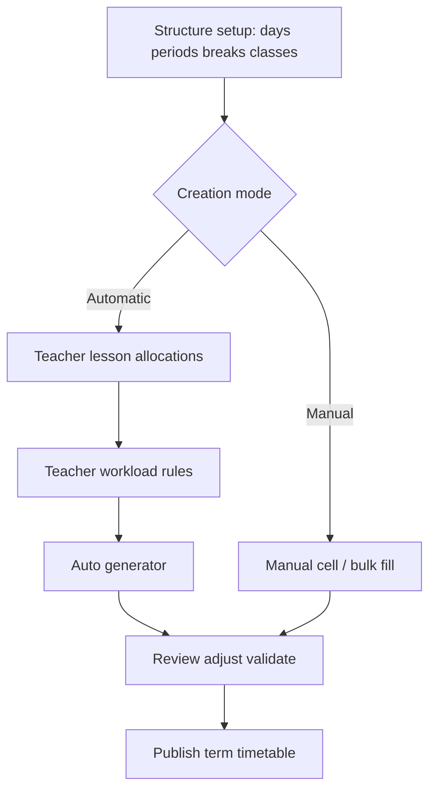

# Timetable Creation — Dual Flow

Two ways to create a school timetable after structure setup (days, periods, breaks, classes).

## Flows

### 1. Manual Timetable Creation (unchanged)

1. Set up timeslots and break allocations (wizard / advanced structure).
2. Fill the generated timetable table cell-by-cell or via bulk lesson entry.
3. System validates teacher/room clashes as users edit.
4. Review → publish for teachers.

### 2. Automatic Timetable Generation (new)

1. Same structure setup as manual.
2. Admin defines **teacher lesson allocations** (demand) and **teacher workload rules** (constraints).
3. Pre-flight checks demand vs capacity and allocation/rule consistency.
4. System generates a balanced draft for the whole school.
5. Teacher/admin review on the same grid; manual adjustments keep clash + quota validation.
6. Publish.

## Product decisions

- **Assignments ≠ rules.**
  - Allocation example: Mathematics · Grade 4 · 7 lessons/week
  - Rule example: max 6 lessons/day · 3 doubles/week · unavailable Friday P6
- **Generation is school-wide** after allocations + rules are configured.
- **Streams:** allocation key is `teacher × subject × gradeLevel × optional stream × lessonsPerWeek`.
- **Naming:** user-facing labels use **Timetable** (not Schedule). GraphQL field names like `SchoolTimetable.schedule` are unchanged.

---

## Domain model

### Teacher lesson allocation (demand)

| Field | Meaning |
|-------|---------|
| `teacherId` | Teacher |
| `subjectId` | Tenant subject |
| `gradeLevelId` | Class/grade |
| `streamId?` | Optional stream |
| `lessonsPerWeek` | Required periods/week (a double counts as 2) |
| `termId` | Term scope |
| `preferredDoubleLessons?` | Optional per-allocation double hint |

Uniqueness: one row per `(term, teacher, subject, grade, stream)`.

**Demand truth:** weekly lesson demand comes from allocations. Workload rules constrain *how* those lessons may be placed; they do not replace allocation counts.

### Teacher workload rules (constraints)

One config per `(term, teacher)`. Each rule is classified by its enforcement level in the generator:

| Rule | Example | Enforcement |
|------|---------|-------------|
| `totalLessonsPerWeek` | 24 | **Preflight warning** — consistency check against the sum of allocations, **not** a placement cap. Demand truth is allocations; the generator places all allocated lessons even if they exceed this rule. |
| `maxLessonsPerDay` | 6 | **Hard** — generator skips slots that would exceed this. |
| `minLessonsPerDay` | 3 | **Soft + review** — generator nudges days toward the minimum (+3 score); frontend `computeWorkloadRuleBreaches` still flags short days after generation. |
| `doubleLessonsPerWeek` | 3 | **Hard** — generator skips double slots when budget is exhausted. |
| `maxConsecutiveLessons` | 3 | **Hard** — generator skips slots that would create a run longer than this. |
| `preferredDays` | Prefer Mon–Thu | **Soft** — +5 to slot score. |
| `avoidDays` | — | **Soft** — −6 to slot score (aligned with prefer/avoid intent; same weight as `avoidPeriodNumbers`). |
| `preferredPeriodNumbers` | Practicals in the morning | **Soft** — +4 to slot score. |
| `avoidPeriodNumbers` | — | **Soft** — −6 to slot score. |
| `unavailableSlots` | `{ dayOfWeek, periodNumber }` | **Hard** — generator skips these slots. Also checked by frontend breach detection. |
| `minFreePeriodsPerDay` | Ensure free periods | **Hard + review** — generator skips placements that would leave fewer free periods than required; frontend also reports `MIN_FREE` breaches. |

---

## UX

### First-run journey (`TimetableJourney`)

The default screen for an administrator who has never built a timetable. Opens with the goal, not the tools: **"Let's create your school timetable"**, then a nine-stop spine that is always visible and always resumable.

| # | Stop | Done when | Opens |
|---|------|-----------|-------|
| 1 | Your school day | lesson times exist | `TimetableSetupWizard` |
| 2 | Your classes | grades loaded | `/classes` |
| 3 | Your teachers | teachers loaded | `/teachers` |
| 4 | Your subjects | subjects loaded | `/classes` |
| 5 | How many lessons each week | ≥1 allocation | generator step 1 |
| 6 | Teacher workload *(optional, skippable)* | ≥1 workload rule | generator step 2 |
| 7 | Create the timetable | ≥1 lesson placed | generator step 3, or "I'll fill it in myself" |
| 8 | Check it over | lessons exist, no clashes | review panel |
| 9 | Share with your staff | published | `TimetableShareDrawer` |

Rules of the surface:

- Stops 2–4 are normally already green from school onboarding, so the journey **confirms** what we know instead of asking for it again. Completed stops list what we found ("15 classes", "8 lessons a day · 5 days a week") with a **Change** link.
- Progress is derived from live data, never from a stored step counter, so leaving and coming back is safe. Footer says so.
- Once any lessons exist the card **shrinks to a strip** (spine + current stop + its action) so it never competes with the grid. It disappears entirely once published.
- **Hide** dismisses it for the session.
- No jargon: no "constraints", "allocations", "optimisation" or "slots" in any journey copy.

### Mode entry

Now scoped to a **single empty class in a school that already has lessons** — the first-run choice lives in the journey card instead, so the two never appear together. A polished overlay asks the admin to choose:

- **Build manually** → dismiss chooser, use current fill UI
- **Auto-generate** (recommended) → open guided Demand → Constraints → Generate drawer

Chooser shows term/class/structure chips when available and reappears when switching to another empty class/term scope. Also available anytime from the timetable overflow menu (`⋮`): **Auto-generate timetable** (desktop and mobile).

### Automatic drawer (guided wizard)

Steps are now named for what the admin is doing, and accept an `initialStep` so the journey can drop them at the right one:

1. **Weekly lessons** — "How many lessons does each subject need?" — the class-by-class planner below
2. **Workload** — "How much should each teacher take?" — limits, morning/evening, preferred/avoid days & periods, unavailable times
3. **Create** — "Ready to create your timetable" — preflight, replace-existing toggle, then **Create my timetable**

While the generator runs it narrates progress in plain language ("Keeping double lessons side by side…", "Making sure no teacher is in two classes at once…") instead of showing a bare spinner, and the result is reported as lessons placed vs. lessons that could not fit.

### Weekly lessons planner (`TimetableWeeklyLessonsPlanner`)

Administrators think class-by-class, so step 1 asks per class instead of per teacher: pick a class chip, then one row per subject with **Lessons**, **Doubles** and **Teacher**. A 15-class school no longer means ~180 hand-typed rows.

- **Only the subjects the class learns.** Rows come from `subjectsForTimetableGrade`; when the curriculum has no mapping for a grade, the helper returns every subject in the school, so the planner starts empty rather than listing all of them and offers **Add a subject** (searchable) instead. Near-duplicate subject names are collapsed.
- **Fill in suggested numbers** applies CBC-style starting points from [`utils/suggestedWeeklyLessons.ts`](./utils/suggestedWeeklyLessons.ts), keyed on subject name and grade band (pre-primary … senior secondary). It never overwrites a number already entered, and it suggests one double for practical subjects.
- **Use these numbers for…** copies lesson counts (never teachers) to other classes. Only classes sharing at least half of this class's subjects are offered, each labelled with how many subjects match, so Grade 4's numbers are never pushed onto a pre-primary class.
- **Capacity is shown as it is typed** — "38 of 40 lesson slots used in Grade 4", or a red warning naming how many lessons over the class is.
- **Saving diffs against `teacher_lesson_allocations`**: create, update lessons/doubles, delete cleared rows, and delete-then-create when the teacher changes (teacher is part of an allocation's identity). Several classes can be edited before one save; the button names how many.
- **Numbers for subjects with no teacher yet are kept**, since they cannot be stored as allocations. Saving reports "N subjects still need a teacher — your numbers are kept", and the values stay on screen until a teacher is chosen.

The old teacher-by-teacher list and add form still live behind **See the same thing teacher by teacher**, for one-off fixes and for allocations that are stream-specific.

### Command bar (desktop header)

Grouped so only decisions live in the bar and display toggles live behind one control:

| Group | Contents |
|-------|----------|
| Context | `Timetable` + live indicator, then term · academic year · class scope |
| Create | **Auto-generate**, **Add lessons** |
| Health | `N to review` (only when issues exist; red for clashes, amber for advisories) |
| Display | **View** popover — subject labels (Codes / Full names), highlight problems, focus on a teacher, refresh |
| Publish | **Publish** / **Publish again** (amber when edited since publishing) |
| Rest | `⋮` overflow for setup, lesson times, breaks, export, danger actions |

Mobile keeps the slim action strip, now with **Auto** (auto-generate) alongside Add / Issues / More.

### Health panel (below the grid)

One panel replaces the old status bar, fill-progress bar and completion banner (all three deleted):

- Status pill — Not started / In progress / Needs attention / Ready to publish, derived from clashes then fill %
- Scope label + a plain-language next step ("594 empty slots left to fill", "Edited since publishing…")
- Fill bar with `filled / total` and a large `%`, colour-matched to status
- Metric tiles: lessons, periods/day, teachers, clashes (clashes tile jumps to review)
- Contextual actions only: review clashes → fill remaining slots → add manually → publish → print

### Review

Same grid editors as manual. The review panel groups issues by severity instead of one flat list:

- **Must fix** — teacher / room clashes, each showing every colliding lesson with an **Open** jump
- **Worth checking** — allocation under/over-fill (`computeAllocationQuotas`) and workload rule breaches (`computeWorkloadRuleBreaches`: `TOTAL_OVER`, `MAX_DAY`, `MIN_DAY`, `MIN_FREE`, `UNAVAILABLE`, `MAX_CONSECUTIVE`)

Anything that surfaces issues (header button, clashes tile, finished generation) enables highlighting and scrolls to `#timetable-review-panel`. Generation also toasts created / unplaced counts.

### Grid

- Today's column is tinted and labelled; mobile opens on today's tab rather than Monday
- Empty slots rest as a faint `+` and reveal "Add lesson" in accent blue on hover/focus, so filled lessons dominate the grid
- Lesson editor saves in accent blue, demotes Delete to a quiet red ghost, and states why saving is blocked ("Pick a teacher to continue.")

---

## Generator (v1)

Deterministic greedy / CSP-style placer (not ML). Feasibility first, then balance. Most-constrained units are placed first.

### Hard constraints (enforced during placement)

| Constraint | How |
|-----------|-----|
| Place required periods per allocation | `expandUnits` splits allocations into single/double lesson units, then placement loop iterates all. |
| Doubles = two consecutive periods | `candidateSlots` requires a consecutive slot at `periodNumber + 1`. |
| No teacher double-booking | `teacherBusy` set prevents two lessons for the same teacher in the same slot. |
| No class-stream double-booking | `classBusy` set (`gradeLevelId:streamId` key) prevents overlaps. |
| Respect `unavailableSlots` | `isUnavailable()` check in `candidateSlots`. |
| Respect `maxLessonsPerDay` | Day load is tracked in `teacherDayCount`; slots exceeding `maxLessonsPerDay` are skipped. |
| Respect `maxConsecutiveLessons` | `wouldBreakConsecutive()` checks the run length after hypothetical placement. |
| Respect `doubleLessonsPerWeek` budget | `teacherDoublesUsed` map tracks doubles placed; slots are skipped when budget is exhausted. |
| Respect `minFreePeriodsPerDay` | After hypothetical placement, free periods on that day must stay ≥ the rule. |
| Use week-template periods only (breaks are non-teaching) | `loadSlots` only returns `DayTemplatePeriod` entries. |

### Soft constraints (scored, best slot picked)

| Constraint | Scoring |
|-----------|---------|
| `preferredDays` | +5 to slot score |
| `avoidDays` | −6 to slot score |
| `preferredPeriodNumbers` | +4 to slot score |
| `avoidPeriodNumbers` | −6 to slot score |
| `preferredTimeOfDay` (`MORNING` / `EVENING`) | +5 matching half of day periods, −4 opposite half (`ANY` = no effect) |
| Spread load across the week | `6 − dayLoad` bonus, favouring lighter days |
| `minLessonsPerDay` | +3 when placing on a day that already has lessons and stays ≤ the minimum |

### Constraints with limited generator enforcement

| Constraint | Status |
|-----------|--------|
| `minLessonsPerDay` | Soft score only during placement; hard shortfalls still surface in post-generation review via `MIN_DAY`. |
| `totalLessonsPerWeek` | Preflight consistency warning only. Allocations are the demand source of truth; this rule does not cap placement. |

### Preflight checks

The backend `preflight()` method (and client `computeLocalPreflight`) checks:

| Check | Severity |
|-------|----------|
| No allocations defined | error |
| Allocation sum ≠ `totalLessonsPerWeek` rule | warning |
| Allocation sum > `maxLessonsPerDay` × school days | error |
| Class demand > available teaching slots | error |
| Preferred days overlap avoid days | warning |
| Preferred periods overlap avoid periods | warning |
| Sum of preferred doubles > teacher double budget | warning |
| All preferred days fully covered by unavailable slots | warning |

Preflight uses the actual set of `dayOfWeek` values from week-template slots for `MAX_DAY_OVERFLOW` (not a hardcoded 5-day week).
### API

- `timetableGenerationPreflight(termId)` — frontend also runs `computeLocalPreflight` as a fast client-side check before calling this.
- `generateTimetable(input: { termId, replaceExisting })` — runs preflight internally; if errors exist, it rejects with a `BadRequestException`.
- `bulkCreateTimetableEntries(input)` — generic bulk entry creator (also callable outside the generator).
- Allocation / rules CRUD mutations and queries (see GraphQL below).

---

## GraphQL surface

All listed queries and mutations are implemented and present in `backend/src/schema.gql`.

### Queries

- `teacherLessonAllocations(termId)` → `[TeacherLessonAllocation!]!`
- `teacherWorkloadRules(termId)` → `[TeacherWorkloadRules!]!`
- `teacherWorkloadRulesForTeacher(termId, teacherId)` → `TeacherWorkloadRules` (nullable)
- `timetableGenerationPreflight(termId)` → `TimetablePreflightResult!`

### Mutations

- `createTeacherLessonAllocation` / `updateTeacherLessonAllocation` / `deleteTeacherLessonAllocation`
- `upsertTeacherWorkloadRules` / `deleteTeacherWorkloadRules`
- `generateTimetable`
- `bulkCreateTimetableEntries`

---

## Key files

### Backend

| Area | Path |
|------|------|
| Module | `backend/src/timetable/timetable.module.ts` |
| Allocation entity | `backend/src/timetable/entities/teacher-lesson-allocation.entity.ts` |
| Workload rules entity | `backend/src/timetable/entities/teacher-workload-rules.entity.ts` |
| Timetable entry entity | `backend/src/timetable/entities/timetable-entry.entity.ts` |
| Week / day template entities | `backend/src/timetable/entities/week-template.entity.ts`, `day-template.entity.ts`, `day-template-period.entity.ts` |
| Generator | `backend/src/timetable/services/timetable-generator.service.ts` |
| Allocation service | `backend/src/timetable/services/teacher-lesson-allocation.service.ts` |
| Workload rules service | `backend/src/timetable/services/teacher-workload-rules.service.ts` |
| Entry service | `backend/src/timetable/services/timetable-entry.service.ts` |
| Resolvers | `backend/src/timetable/resolvers/*` |
| DTOs / inputs / outputs | `backend/src/timetable/dtos/*` |

### Frontend

| Area | Path |
|------|------|
| First-run journey | `components/TimetableJourney.tsx` |
| Mode entry | `components/TimetableModeEntry.tsx` |
| Auto-generate drawer | `components/TimetableAutoGenerateDrawer.tsx` |
| Weekly lessons planner | `components/TimetableWeeklyLessonsPlanner.tsx` |
| Suggested lesson counts | `utils/suggestedWeeklyLessons.ts` |
| Allocations hook | `hooks/useTeacherLessonAllocations.ts` |
| Pre-flight util (client) | `utils/allocationPreflight.ts` |
| Quota / rule breaches | `utils/computeAllocationQuotas.ts` |
| Review panel (severity groups) | `components/TimetableConflictsPanel.tsx` |
| Health panel | `components/TimetableHealthPanel.tsx` |
| Shared theme tokens | `utils/timetableTheme.ts` |
| Admin page wiring | `page.tsx` |
| Types | `frontend/lib/types/timetable-allocation.ts` |

---

## Implementation status & known gaps

### ✅ Complete (dual-flow feature)

- Backend: entities, services, resolvers, DTOs for all new types
- Backend: greedy generator with hard/soft constraint scoring (including `minFreePeriodsPerDay` hard skip, soft `avoidDays` / `minLessonsPerDay`)
- Backend: preflight with demand-vs-capacity + contradictory-constraint warnings
- Migration: `backend/src/timetable/migrations/1754300000000-teacher-allocations-and-workload-rules.ts`
- GraphQL: all queries and mutations in `schema.gql`
- Frontend: mode entry overlay, guided auto-generate wizard (Demand → Constraints → Generate), conflicts panel with quotas/breaches
- Frontend: rules support numeric limits, preferred/avoid days & periods, morning/evening preference, unavailable slots
- Frontend: replace-existing toggle on generate step; post-generate hydrate + conflicts panel
- Frontend UX overhaul: grouped command bar with single **View** popover, consolidated health panel (replacing `TimetableStatusBar`, `TimetableFillProgress`, `TimetableCompletionBanner`, `TimetableProgressStrip` — all deleted), severity-grouped review panel, today-aware grid, quieter empty slots, accent-consistent lesson editor with blocked-save reasons
- Frontend: class-by-class **weekly lessons planner** on drawer step 1 (curriculum-scoped subject rows, CBC-style suggested counts, copy numbers to sibling classes, capacity read-out, multi-class diffed save) — replaces teacher-by-teacher demand entry as the default
- Frontend: `useTeacherLessonAllocations` hook with full CRUD + generate + preflight
- Frontend: `computeAllocationQuotas` and `computeWorkloadRuleBreaches` (incl. `MIN_FREE`) for post-generation review
- Frontend: `computeLocalPreflight` for fast client-side validation (incl. contradictory warnings)
- Desktop **and mobile** overflow menu entry for "Auto-generate timetable"
- Post-generate hydrate: drawer passes `generateTimetable.entries` into the store, then reloads

### ✅ Restored for E2E (recovered Nest app)

After the Aug 2026 wipe, classic timetable APIs were missing from the live Nest GraphQL schema. Restored minimum surface so dual-flow can run against this backend:

| API | Purpose |
|-----|---------|
| `createWeekTemplate` / `getWeekTemplates` / `getWeekTemplate` | Structure for wizard + generator slots |
| `createTimetableBreak` | Wizard breaks |
| `getSchoolTimetable` | Grid structure + schedule reload |
| `getTimetableEntries` / `createTimetableEntry` / `deleteTimetableEntry` | Lesson CRUD + post-gen reload |
| `ActiveUser` + `x-tenant-id` | Tenant context (JWT tenantId or cookie header) |
| GraphQL `context: { req }` | So `ActiveUser` can read headers |
| `getTeachers` / `tenantSubjects` / `gradeLevelsForSchoolType` | Allocation drawer + store loads |
| `getSchoolConfiguration` | App shell / `useSchoolConfig` (built from `ref_*` demo data) |
| `seedTimetableReferenceData` (+ auto-seed when empty) | Demo teachers/subjects/grades for empty DB |
| Teacher API route → local GraphQL | `frontend/app/api/school/teacher/route.ts` uses `resolveGraphqlEndpoint()` |
| Entry nested names from `ref_*` | `getSchoolTimetable` / `getTimetableEntries` resolve teacher/subject/grade/stream labels |

**Verified E2E (local GraphQL, tenant `demo-tenant`):** week template → allocation → workload rules → preflight → `generateTimetable` → entries on `getSchoolTimetable` (e.g. 5 Kamau/Math lessons as 4 entries including one double).

**Critical fix:** Nest `ValidationPipe({ whitelist: true })` was stripping GraphQL `@Field()` inputs (no class-validator decorators), which broke `createWeekTemplate` and would break other mutations. Set `whitelist: false` in `backend/src/main.ts`.

**Still incomplete vs full pre-wipe API:** publish/unpublish, rebuild periods, room entities, full conflict payload from server.

### ⚠️ Remaining (by design / out of scope)

| Gap | Severity | Detail |
|-----|----------|--------|
| `totalLessonsPerWeek` is a preflight warning only | Medium | By design: allocations are demand truth; this rule is a consistency check, not a placement cap. UI copy clarifies this. |
| `minLessonsPerDay` is soft, not hard | Low | Soft score + post-gen `MIN_DAY` review. Promote to hard only with an explicit product decision. |
| Room assignment not handled by generator | Out of scope (v1) | Generated entries have `roomId: null`. |
| Reference data is demo stubs | Medium for prod restore | Local `ref_*` tables stand in for wiped Teacher/Subject/Grade modules. Replace when those modules return. |

### 🗺️ Next, for the first-time administrator

Ordered by how badly each one blocks a deputy head who has never used timetable software.

| Next | Why it matters | Cost |
|------|----------------|------|
| **Rooms as real resources** (Computer Lab, Science Lab…) | Journey stop for special rooms cannot be honest until the generator knows a lab holds one class. Today a room is free text and clashes are only spotted afterwards. | Entity + migration + hard constraint + room view |
| **"3 things need your help"** with *Fix automatically / Review one by one / Leave it* | The review panel already groups by severity; what's missing is the automatic fix and the one-by-one walk. | Frontend + a repair pass in the generator |
| **Drag a lesson to move it**, with a named warning and suggested alternative times | Administrators expect to move a lesson by dragging it; today they open it and change dropdowns. | Frontend only |
| **Teacher view and room view** of the grid | Deputy heads check "does Mr Kamau's week look fair?" — currently only a highlight and a list. | Frontend (teacher data already queryable) |
| **Publish audiences + PDF/Excel** | Publishing is a single teachers-only flag; export is CSV and print. | Backend flag work + export libraries |
| **"What if?" and plain-language questions** | "Can Mr Kamau have Friday afternoon free?" — many of these are answerable from data we already compute, without an LLM. | Larger; scope after the above |

---

## Out of scope (v1)

- Per-teacher isolated generate as the primary UX (can add "regenerate this teacher" later)
- Room capacity / lab equipment solver
- Genetic / AI solvers
- Changing parent/staff URL paths
- Using `creditHours` as the source of truth for weekly demand

---

## Ops notes

- New tables: `teacher_lesson_allocations`, `teacher_workload_rules`.
  - With `DATABASE_SYNC=true`, TypeORM can create them automatically.
  - With migrations: run [`backend/src/timetable/migrations/1754300000000-teacher-allocations-and-workload-rules.ts`](../../../backend/src/timetable/migrations/1754300000000-teacher-allocations-and-workload-rules.ts) (requires `gen_random_uuid()` / PG 13+).
- Tenant comes from JWT `tenantId`; recovery builds also accept `x-tenant-id`.
- Manual flow remains fully usable without allocations or auto-gen.
- **Split GraphQL proxy (local dual-flow):** set `GRAPHQL_API_URL` to production for shell APIs (`academicYears`, stats, teachers, school config) and `LOCAL_GRAPHQL_API_URL=http://localhost:3001/graphql` for allocation/generate/week-template/entry ops. `/api/graphql` routes by operation. Restart Next after changing env.

## Success criteria

- Admin can build a term timetable **without** auto-gen (parity with before).
- Admin can define allocations + workload rules, run generate, and get a draft with clear unresolved warnings if needed.
- Draft can be edited; clashes and unmet quotas are visible before publish.
- Product language consistently says **Timetable** in school admin navigation and timetable chrome.
