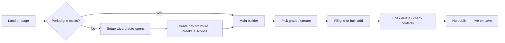

# Timetable UX Review

**Audience:** School administrators, teachers, and first-time digital timetable users (non-technical).  
**Scope:** Admin timetable flow from landing on the page through create, edit, manage — and expected “publish.”  
**Code reference:** `timetable/page.tsx` and related components (wizard, grid, drawers, dialogs).  
**Last reviewed:** May 2026

---

## Table of contents

1. [Executive summary](#executive-summary)
2. [Journey map](#journey-map)
3. [Chapter 1 — Arriving on the page](#chapter-1--arriving-on-the-page)
4. [Chapter 2 — First-time setup (wizard)](#chapter-2--first-time-setup-wizard)
5. [Chapter 3 — Main page before a class is chosen](#chapter-3--main-page-before-a-class-is-chosen)
6. [Chapter 4 — Choosing class and stream](#chapter-4--choosing-class-and-stream)
7. [Chapter 5 — Setting school hours (again)](#chapter-5--setting-school-hours-again)
8. [Chapter 6 — Breaks](#chapter-6--breaks)
9. [Chapter 7 — Adding lessons](#chapter-7--adding-lessons)
10. [Chapter 8 — Editing and fixing mistakes](#chapter-8--editing-and-fixing-mistakes)
11. [Chapter 9 — Conflicts (clashes)](#chapter-9--conflicts-clashes)
12. [Chapter 10 — Publish (missing)](#chapter-10--publish-missing)
13. [Chapter 11 — Mobile and small screens](#chapter-11--mobile-and-small-screens)
14. [Chapter 12 — Errors and validation](#chapter-12--errors-and-validation)
15. [Chapter 13 — Visual hierarchy](#chapter-13--visual-hierarchy)
16. [Chapter 14 — Reducing clicks and repetition](#chapter-14--reducing-clicks-and-repetition)
17. [Persona snapshots](#persona-snapshots)
18. [Naming cheat sheet](#naming-cheat-sheet)
19. [Ideal end-to-end journey (target state)](#ideal-end-to-end-journey-target-state)
20. [Priority backlog](#priority-backlog)
21. [Known implementation gaps](#known-implementation-gaps)

---

## Executive summary

The timetable experience has a **strong guided setup wizard** and a **familiar weekly grid** for adding lessons. The main builder page still reads like a **power-user admin console**: duplicate setup paths, technical jargon, weak guidance after setup, incomplete conflict UX, and **no publish / go-live step**.

| Strength | Gap |
|----------|-----|
| 5-step wizard with plain questions | Main page overload (many toolbar actions) |
| Click cell → add lesson | No persistent “Step 1 → 2 → 3” on main page |
| Teacher busy/available hints in lesson drawer | Conflict toggle doesn’t highlight grid cells |
| Grade chips for quick switching | “Stream” unexplained; lesson drawer doesn’t show section |
| Term selection in global navbar | Term not obvious from timetable page alone |
| Good stats cards (lessons, conflicts) | “Active periods” is confusing — should be “Periods per day” |
| Visual break rows (amber background) | Break-sheet delete buttons are no-ops (broken) |

**Critical finding #1:** There is **no publish workflow** in the UI. Changes appear live on save. Users expecting “draft → review → publish” will feel the product is unfinished or unsafe.

**Critical finding #2:** Two onboarding paths exist (full-screen `TimetableSetupWizard` + inline `TimetableOnboarding` component). The inline `TimetableOnboarding` is exported but **never rendered** on the page — dead code that could confuse future developers and suggests a half-finished alternate flow.

---

## Journey map



---

## Chapter 1 — Arriving on the page

### What the user sees

- App shell: school sidebar, top bar with **term dropdown** (`TermsDropdown` — not on the timetable page itself).
- Page title: **“Timetable Builder”**.
- Subtitle: `Term 1 • Structure and schedule management` OR *“Create structure, assign lessons, and resolve conflicts faster.”*
- If no period grid: **full-screen `TimetableSetupWizard`** (unless previously skipped via localStorage).

### What they think

- *“Builder” and “structure” sound like software, not school work.*
- *“Which term am I editing?”* — only hinted in subtitle; real control is top-right of the app.
- *“Whole school or one class?”* — not answered on first paint.

### Friction

| Issue | Impact |
|-------|--------|
| Technical title and subtitle | Low trust, unclear task |
| Term control off-page | Wrong term edited silently |
| Auto-wizard vs skip | Skip → empty page, little guidance |

### Recommendations

| Current | Suggested |
|---------|-----------|
| Timetable Builder | **School timetable** |
| Structure and schedule management | **Set lesson times, then add subjects and teachers** |
| (no term on page) | **Editing: Term 1 (2025–2026)** + link **Change term** (navbar) |
| Generic subtitle when no term | **Choose your school year and term first** (with actions) |

**Onboarding banner (until complete):**

> **Step 1 of 3:** Set school day times → **Step 2:** Add lessons → **Step 3:** Check for clashes

Show checkmarks; hide when done for the selected term.

---

## Chapter 2 — First-time setup (wizard)

### Trigger

- No time slots + wizard not marked complete → wizard opens.
- **“Set up later”** dismisses wizard; user may never return.
- If the user hits “Set up later,” there is **no persistent reminder banner** to finish setup. The only way back is the `⋯` menu (hidden icon — many users never discover it).

### Before the wizard launches

There is no welcome or explanation. The full-screen takeover can feel jarring. **Add:**

> “Welcome! Before you can schedule lessons, let’s set up your school day. This takes about 2 minutes.”

Then let them click **Get Started**.

### Step-by-step evaluation

| Step | User-friendly? | Friction | Suggested fix |
|------|----------------|----------|---------------|
| Prerequisites (year + term) | Yes | Hidden trigger buttons for modals | **Add school year** / **Add term** + *Same as fees and reports* |
| 1 — School day | Yes | “Period” in preview; 24h time input vs AM/PM presets | Say **lesson** in copy; “Period 1” OK on grid; use AM/PM time picker consistently |
| 2 — Days per week | Mostly | Only Mon–Fri/Sat/Full-week presets — no Sunday–Thursday (common in Middle East) | **Which days?** with toggle buttons for each day (Sun–Sat), default Mon–Fri |
| 3 — Breaks | Mostly | “After period”, “Before period 1”; 8 break types cause decision fatigue; no visual timeline preview | **After which lesson?** with human labels; reduce to 3-4 common types + Custom; show timeline preview with breaks inline |
| 4 — Grades & streams | Confusing | **Stream**, “one timetable per stream”; no indication of which grades already have timetables; “Whole grade (no streams)” is technical | **Section**; examples: *Grade 4 East, Grade 4 West*; show existing timetable warnings; “One timetable for this grade” |
| 5 — Review | Mostly | Auto-generated name is ALL CAPS (“TERM 1 TIMETABLE 2026”); no breaks shown in period preview; no “Edit” links per section | Title case: “Term 1 Timetable 2026”; show full timeline including breaks; add **Edit** links per row |

### Break step — deeper dive

**“After period” is unintuitive.** A user entering “After period 3” for lunch sees lunch appear between Period 3 and 4 in the grid later. But some users may think it means “lunch starts after period 3 ends” and be confused by the visual placement.

**Fix:** Label it **“Between which lessons?”** with two selectors: *After lesson* [3] *and before lesson* [4]. Or display it as: **Between Period 3 and 4**.

**The 8 break types** (Assembly, Short Break, Lunch, Long Break, Tea Break, Recess, Snack Break, Games Break) are overwhelming. Most schools need 2-3. Show only: Lunch, Short Break/Morning Tea, Assembly, and a “Custom” option. Use a free-text type field for Custom.

**Break names** should auto-suggest real names: “Lunch,” “Morning Tea,” “Assembly,” “Prayer Time.” The placeholder should include: *“e.g., Morning Tea, Lunch, Prayer Time”*.

**Breaks are tied to period numbers** (afterPeriod). If the user later changes the period count, the wizard caps values (`Math.min`) but doesn’t warn the user. Warn: *“You changed from 8 to 6 periods. Some breaks may need adjusting.”*

**No preview timeline** in the breaks step. After configuring breaks, show:

```
8:00 AM  Period 1
8:40 AM  ☕ Morning Tea (15 min)
8:55 AM  Period 2
...
12:15 PM 🍽️ Lunch (45 min)
1:00 PM  Period 5
```

### Review step — deeper dive

**No “Edit” links per section.** The user must click Back multiple times to reach a specific step. Add:

> School day: 8:00 AM, 8 periods × 40 min  **[Edit]**
> Week: 5 days (Mon–Fri)  **[Edit]**
> Breaks: 3 configured  **[Edit]**
> Classes: Grade 4 East, Grade 5  **[Edit]**

**The period preview table** shows start/end times only. It does not show where breaks fall — a crucial omission since the user just spent time configuring them. Show the full timeline with breaks interspersed.

**The success toast** is too terse:
> “Timetable structure created. 8 periods × 5 days. You can now add lessons to the grid.”

Better:
> **“Done! Your schedule is ready.”** Next: add subjects and teachers to each period in the grid below.

### After wizard

- Empty grid, no forced next step.
- `hasLessons` computed in `page.tsx` but **not shown** in UI.

**Recommendations:**

- Auto-select first grade after wizard.
- Pulse first empty **Add** cell OR open lesson drawer once with tutorial copy.
- Show inline guidance: **“Tap any + box to add your first lesson.”**

---

## Chapter 3 — Main page before a class is chosen

### What the user sees

- Toolbar: **Add lessons** (hidden until grade selected), **Schedule**, **Breaks**, **Show conflicts**, **⋮**
- Grade chips + optional **Start with Grade X**
- Left sidebar **Grades** via `DashboardSearchSidebar` (student-search patterns)
- Empty state: **Choose a grade to begin**

### Friction

1. Two grade pickers (chips + sidebar) — sidebar feels like student search.
2. Five toolbar actions before choosing a class.
3. **Schedule** (toolbar) vs **Edit structure** (section) — same intent, different labels.
4. `TimetableOnboarding` component exists but is **not used** on the page.

### Empty state copy

| Current | Suggested |
|---------|-----------|
| Choose a grade to begin | **Pick a class to see its timetable** |
| …header chips or the sidebar… | **Tap a class name above** (drop sidebar until fixed) |

**Recommendation:** Replace search sidebar with a simple class list (no search unless 20+ grades).

---

## Chapter 4 — Choosing class and stream

### Flow

1. Tap grade chip → stats appear.
2. If streams exist → row labeled **STREAM**.

### Concepts (must be explained in UI)

- **Grade** = level (e.g. Grade 5).
- **Stream / section** = group within grade; **lessons are per section** on a shared period grid.
- Wizard may create one structure per stream; switching stream changes which lessons you edit.

### Recommendations

| Current | Suggested |
|---------|-----------|
| Stream | **Section** (tooltip: *e.g. East, Blue class*) |
| (none) | Sticky: **Editing lessons for: Grade 5 — East** |

### Stat cards

| Current | Suggested |
|---------|-----------|
| Selected grade | **Class** |
| Total lessons | **Lessons scheduled** |
| Active periods | **Periods per day** (e.g. 8 slots) |
| Conflicts | **Schedule clashes** |

**“Active periods”** is especially confusing — it sounds like periods that are currently running. **“Periods per day”** or **“Lesson slots”** is clearer.

**Stats cards only appear after selecting a grade.** Before grade selection, the space below the toolbar is empty. Show a summary card: **“8 periods/day · Mon–Fri · 3 breaks”** even before a grade is chosen so the user knows the schedule structure exists.

---

## Chapter 5 — Setting school hours (again)

### Entry points (duplicate)

| Entry | Opens |
|-------|--------|
| Toolbar **Schedule** / **Setup** | `BulkScheduleDrawer` or wizard |
| **Edit structure** / **Create schedule** | Same |
| **⋮ → Timetable setup wizard** | `TimetableSetupWizard` |

### Friction

- Wizard = plain language; Bulk drawer = dense (**Grade Levels**, **Lesson Periods**, G4/F1 abbreviations).
- **Replace Timetable** warns about deleted lessons; **Edit structure** does not repeat warning.
- Users think setup is done after wizard, then open **Schedule** again.

### Recommendations

- **First time:** wizard only.
- **Later:** single **School hours & breaks** (under ⋮ or Settings).
- Hide toolbar **Schedule** for beginners after setup.

---

## Chapter 6 — Breaks

### Entry points

1. Wizard step 3  
2. Toolbar **Breaks** → `BulkBreaksDrawer`  
3. Coffee icon on period row (**hover only**)  
4. Click break in grid  
5. **⋮ → View breaks**

### Bugs / friction

| Issue | Detail |
|-------|--------|
| View breaks sheet | Delete buttons use `onClick={() => {}}` — **no-op** |
| Break list | Shows raw type e.g. `SHORT_BREAK` |
| Period row actions | Hover-only — poor on touch |
| Dual break-type enums | `BreakManager` uses lowercase (`'short_break'`); `BreakEditDialog` uses uppercase (`'SHORT_BREAK'`) — unify |

### Recommendations

- One **Breaks & lunch** hub: list + add with name, **after lesson N**, duration, **all days**.
- Fix or remove broken delete buttons.
- Unify break-type enum casing across components.

---

## Chapter 7 — Adding lessons

### Methods

| Method | Best for | UX |
|--------|----------|-----|
| Grid cell **Add** | One lesson | Most intuitive |
| Toolbar **Add lessons** | Many on one day | Power users |
| (unused) `TimetableOnboarding` | — | Not rendered |

### Lesson drawer fields

| Field | Note |
|-------|------|
| Subject | Filtered by grade; if empty → show **“No subjects found for this grade. Assign subjects in the Classes page first.”** with a link |
| Teacher | Good busy/available messaging. But filtering by grade level is invisible — add note: **“Showing 5 of 12 teachers (filtered for this grade)”** |
| Room | Free-text — flexible but no validation. Consider autocomplete from existing rooms to prevent “Room A” vs “room a” variants |
| Double period | Rename to **Lesson runs across two consecutive periods**. Add preview of the actual time range (e.g., “Periods 3-4: 8:40–10:00 AM”) |
| Header | Add **Class: Grade X — Section** (stream not shown today). Title should say **Add New Lesson** (not “Edit Lesson”) for new entries |
| Auto-suggest | If a teacher is assigned to this grade and teaches the selected subject, pre-select them. This saves a click for the most common case |

### Error messages to remove from user view

- “Time Slots Need Reloading”
- `dayTemplatePeriodId`, UUID validation details
- “Subject ID … not found in store”
- Any UUID or GraphQL path in toasts

**User-facing:** *Something didn’t load. Refresh the page and try again.*

### Bulk add drawer gaps

- Only Mon–Fri hardcoded (wizard allows 6–7 days).
- **Add Row** → **Add another lesson**
- No copy day to another day.
- **Day selector defaults to Monday** with no visual emphasis on which day is selected — the summary at the bottom helps but should be more prominent.
- **No multi-day selector.** The #1 missing feature: “English Period 1 on Monday, Wednesday, and Friday.” Users must open this drawer three times. Add checkboxes for each day of the week.
- **Period dropdown disables used slots** (good) but no tooltip explains *why*. Add: *“Already assigned”* on hover.
- **Lesson rows are numbered** (1, 2, 3) but this is cosmetic only. No “auto-fill” or “copy row” button.

---

## Chapter 8 — Editing and fixing mistakes

### What works

- Tap lesson → edit; delete with confirmation.
- Grade chips to switch class.

### Friction

| Situation | Problem | Fix |
|-----------|---------|-----|
| Wrong teacher | Per-cell only | Clash list → jump to cell |
| Wrong day | Bulk is one day | Copy day / move lesson |
| Delete period | Minimal confirm dialog | Explain lesson impact |
| ⋮ delete menu | Three similar red items | Distinct names + counts |
| Toasts | **Failed** / **Error** | Actionable message |
| No undo | Fear of mistakes | 5s undo toast after delete (like Gmail’s “Undo send”) |
| Time column controls | Edit/delete/break buttons hidden until hover (2.5px icons) | Whole time cell should be clickable; visible controls on touch |
| Double-period continued cell | Shows “↳ continued” but can't be edited from there | Clicking the continuation cell should open the same edit dialog |
| No completion indicator | User doesn't know how many periods are filled | Progress bar per day: “Monday: 7/8 periods filled” |

### Delete menu — suggested rename

| Current | Suggested |
|---------|-----------|
| Delete periods | **Reset lesson times** (with scope text) |
| Delete lessons | **Clear all lessons** (keep times) |
| Delete timetable | **Delete entire timetable for [Term name]** |

Add confirmation body: what is removed, that it **cannot be undone**, require **DELETE** for term-level.

---

## Chapter 9 — Conflicts (clashes)

### Expected behavior

Toggle **Show conflicts** → red cells → list of problems → fix.

### Actual behavior (gaps)

| Gap | Detail |
|-----|--------|
| Grid highlight | `conflictLessonIds` **not passed** to `AdminTimetableGrid` |
| Resolve now | Opens **BulkLessonEntryDrawer** — does not resolve clashes |
| No list panel | `ConflictsPanel` exists in folder, not wired on page |
| Badge count missing | “Show conflicts” button shows no count — user doesn't know clashes exist until they toggle |

### Copy

| Current | Suggested |
|---------|-----------|
| Conflicts | **Clashes** / **Scheduling problems** |
| scheduling conflicts detected | **A teacher or room is booked twice at the same time** |
| Show conflicts | **Highlight problems [3]** (with badge count) |
| Resolve now | **See what’s wrong** |

### Minimum fix

1. Pass conflict IDs to grid → highlight cells.  
2. Side panel with who / when / which classes.  
3. **Jump to lesson** / change teacher.
4. Show badge count on toggle: `⚠ Problems (3)`.

---

## Chapter 10 — Publish (missing)

### User expectation

Draft → review → **Publish** → teachers and parents see it.

### Current behavior

- No draft/published state in timetable UI.
- **Teachers likely see data as soon as lessons are saved** (separate teacher timetable page).
- No PDF export, notify, or approval from this flow.

### Until publish is built

Show on page:

> **Teachers see changes as soon as you save a lesson.**

### Future publish feature

| Element | Purpose |
|---------|---------|
| Status | **Draft** \| **Published** |
| Banner (draft) | Only admins see edits |
| **Publish timetable** | Checklist: times ✓, classes filled, 0 clashes (optional override) |
| Block or warn | Publish with unresolved clashes |

---

## Chapter 11 — Mobile and small screens

| Element | Issue | Recommendation |
|---------|--------|----------------|
| Weekly grid | Horizontal scroll | Sticky day headers; switch to day-by-day swipe view on phones |
| Toolbar | Many wrapped buttons | Prioritize **Add lesson** + **Clashes**; collapse rest into “Actions” dropdown |
| Hover controls | Edit/delete hidden | Visible **⋯** on each cell |
| Bulk schedule drawer | `w-[600px]` | Full-width on small screens |
| Layout | Nested `h-screen` | Avoid double scroll |
| Sidebar | Extra navigation | Rely on grade chips on mobile |

**Rule:** No hover-only actions on touch devices.

---

## Chapter 12 — Errors and validation

### Good examples

- Wizard: *“Enter 1–20 lessons per day”*
- Bulk drawer: *“Select at least one grade”*
- Lesson form: busy teacher list and warnings

### Bad examples (never show to users)

- Internal IDs (`dayTemplatePeriodId`, UUID errors)
- GraphQL paths in toasts
- Generic **Failed** / **Error**
- “Subject ID … not found in store”

### Template

> **[What happened].** [What to do: Refresh / Pick another teacher / Try again.]

---

## Chapter 13 — Visual hierarchy

### Feels overwhelming

- 6+ header actions + ⋮ + grade row + stream row + 4 stat cards + section header + grid.
- Duplicate setup entry points.
- Jargon: structure, schedule, periods, streams, entries, active, templates.
- The `⋯` (More Horizontal) dropdown hides critical actions behind an obscure icon many users never discover: View periods, View breaks, and all three delete options.
- Two grade pickers (chips in header + sidebar) create redundancy and confusion.

### Feels simple

- Wizard open (progress bar, one question per step).
- Single cell **Add** → one form.
- Grade chips for quick switching between classes.
- Break rows visually distinct (amber background).

### Target layout

```
School timetable · Term 1, 2025–26          [Change term]

[●───○───○]  1. School times  2. Lessons  3. Check clashes

[ Grade 5 ▼ ]  [ East ▼ ]     [ + Add lesson ]  [ ⚠ 2 clashes ]

┌── Weekly timetable ──────────────────────┐
│  Mon    Tue    Wed ...                    │
└──────────────────────────────────────────┘

⋯ School hours · Breaks · Advanced
```

---

## Chapter 14 — Reducing clicks and repetition

| Task today | Pain | Shortcut to add |
|------------|------|-----------------|
| Fill one day | Many cell opens | Promote **Fill one day** (bulk drawer exists) |
| Copy Mon → Tue | ~~Not available~~ | **Duplicate day** in bulk drawer |
| Move lesson slot | Edit in place only | **Move to another slot** in lesson drawer |
| Same subject all week | 5× repeat | **Add across week** (multi-day checkboxes in bulk drawer) |
| Same times all grades | Wizard scopes | Copy: *Same bell times for every class* |
| Re-open setup | 3 menus | One **School hours** |
| Fix clash | Manual hunt | Clash list → cell |
| Change term | Navbar only | Term on timetable header |
| See teacher's full schedule | Must click every cell | **View by Teacher** toggle that recolors grid or adds teacher filter |
| Bulk-select cells | Not available | Shift-click or drag-select multiple cells, then assign subject/teacher to all |

---

## Persona snapshots

### School secretary (first digital timetable)

Opens page → wizard completes → lands on busy main page → doesn’t select a class → tries **Schedule** again → thinks she is finished → some classes still empty.

### Teacher (delegated admin)

Understands grid. **Stream** unclear. Adds lesson to wrong section. **Show conflicts** doesn’t highlight → assumes bug.

### Principal (review only)

Asks *“Is it published?”* — no status, no PDF, no approval step.

---

## Naming cheat sheet

### Page and sections

| Current | Suggested |
|---------|-----------|
| Timetable Builder | School timetable |
| Weekly timetable (subtitle: by day and period) | **Your week at a glance** — tap a box to add a lesson |
| Structure / schedule structure | School day setup (times & breaks) |

### Buttons and menus

| Current | Suggested |
|---------|-----------|
| Setup / Create schedule | Set up lesson times |
| Schedule | School hours (hide after first setup) |
| Edit structure | Change lesson times |
| Add lessons | Add several lessons (one day) |
| Grid: Add | + Add lesson |
| Show conflicts / Hide conflicts | Highlight problems **[3]** / Hide highlights |
| Resolve now | See what’s wrong |
| Timetable setup wizard | Guided setup again |
| View periods | Lesson times list |
| Set up later | Continue without setup (show reminder banner) |

### Concepts

| Technical | Plain language |
|-----------|----------------|
| Week template | Weekly layout |
| Period / time slot / day template period | Lesson slot (Period 1, 2…) |
| Lesson periods per day | Number of lessons per day |
| Grade levels | Classes / grades |
| Stream | Section / class group |
| Entries | Lessons |
| Bulk schedule | Set up lesson times for all classes |
| Active periods | Periods per day / Lesson slots |
| Timeslot | Period |
| Day template / week template | Daily schedule / Weekly layout |
| Create timetable entry | Add lesson |

---

## Ideal end-to-end journey (target state)

1. **Land** — “We’ll set lesson times, then fill in subjects.” → **[Start]**
2. **School year & term** — inline if missing (not navbar-only).
3. **School day** — start time, lesson count, duration, weekdays (with day-of-week toggles).
4. **Breaks** — suggested lunch; can skip. Simple types (Lunch, Short Break, Assembly, Custom).
5. **Which classes** — all selected by default, plain names. Warn if grade already has a timetable.
6. **Review** — full timeline with breaks shown. Edit links per section.
7. **Create** — empty grid + **Add your first lesson** on Mon Period 1.
8. **Pick class** — chips + clear **Editing: Grade 5 — East**.
9. **Fill grid** — cell tap; copy day / bulk with multi-day selection.
10. **Check clashes** — badge count on button; highlight + list; fix in place.
11. **Publish** — “Share with teachers” (future).

---

## Priority backlog

### P0 — Trust and correctness

| # | Item |
|---|------|
| 1 | Wire `conflictLessonIds` to grid; fix **Resolve now** |
| 2 | User-safe error messages (no UUID/GraphQL in toasts) |
| 3 | Fix or remove broken delete on **View breaks** sheet |
| 4 | Rich delete confirmations (scope, counts, term name) |

### P1 — Clarity and one path

| # | Item |
|---|------|
| 5 | Rename page title, subtitle, primary buttons (cheat sheet) |
| 6 | Post-wizard: progress strip + **Add first lesson** nudge |
| 7 | Term/year visible on timetable page |
| 8 | ~~Unify setup: wizard first; demote `BulkScheduleDrawer`~~ — confirm gate + renamed advanced |
| 9 | **Stream** → **Section** + “Editing X” in lesson drawer |
| 10 | Publish OR **“Live as you save”** banner |
| 11 | Show badge count on “Show conflicts” button: `⚠ Problems (3)` |
| 12 | Add multi-day selection to bulk lesson drawer (Mon+Wed+Fri) |
| 13 | Show breaks in wizard review step timeline preview |
| 14 | **Add New Lesson** dialog title (not “Edit Lesson”) for new entries |
| 15 | Day-of-week toggle in wizard step 2 (not just Mon–Fri presets) |

### P2 — Polish and mobile

| # | Item |
|---|------|
| 16 | ~~Touch-visible edit/delete on grid~~ — shipped (visible on mobile, hover on desktop) |
| 16b | ~~Mobile day view + compact toolbar~~ — shipped |
| 17 | ~~Remove/replace `DashboardSearchSidebar`~~ — `TimetableClassSidebar` in use |
| 18 | ~~Wire `TimetableOnboarding` checklist~~ — wired on empty state |
| 19 | ~~Copy day / reduce bulk repetition~~ — duplicate day to targets in bulk drawer |
| 20 | ~~Conflict side panel~~ — `TimetableConflictsPanel` wired |
| 21 | ~~Reduce break types in wizard~~ — 4 presets + custom |
| 22 | ~~Auto-suggest teacher~~ — `pickTeacherForSubject` |
| 23 | ~~Room autocomplete~~ — datalist + normalize on save |
| 24 | ~~“No subjects found” + Classes link~~ — shipped |
| 25 | ~~Teacher count note for grade~~ — shipped in lesson dialog |
| 25b | ~~Move lesson to another day/period~~ — edit drawer (create + delete) |

### P3 — Future

| # | Item |
|---|------|
| 26 | ~~Draft / Published workflow~~ — lightweight **Share with staff** drawer + local “marked shared” (no backend gate) |
| 27 | PDF / notify teachers — partial: print, CSV, copy, email mailto, share checklist |
| 28 | ~~Undo toast for lesson delete (5-second window like Gmail)~~ — shipped |
| 29 | ~~“View by Teacher” toggle — recolor grid by teacher assignment~~ — shipped (filter) |
| 30 | ~~Subject distribution check~~ — shipped (`TimetableSubjectInsights`) |
| 31 | ~~“Last modified” indicator~~ — shipped (`TimetableLastUpdated`) |
| 32 | ~~Completion progress bar per grade~~ — shipped (`TimetableFillProgress` + completion banner) |
| 33 | Browser print + copy class summary (lightweight share) — shipped |

---

## Known implementation gaps

| Item | Location / notes |
|------|------------------|
| Publish / share | **Share with staff** drawer: checklist, mark shared (localStorage), stale-after-edit warning; teachers still see saves live |
| Duplicate setup flows | Wizard primary; `BulkScheduleDrawer` behind confirm + “Advanced” label |
| Break types | Unified via `@/lib/utils/timetable-break-types` (store + `BreakEditDialog` + bulk breaks) |
| Wizard weekdays | Toggles set **count** of days (Mon→…); API does not support skipping Tue while keeping Wed |
| Subject balance warnings | Heuristic panel when grade subjects are configured in school config |
| PDF | Use print or CSV → Excel → Save as PDF; no native PDF lib |
| Notify teachers | mailto + clipboard summaries in ⋮ menu & share drawer |
| Mobile | Day tabs on grid; compact Actions menu; sidebar auto-hidden below lg; stat cards hidden on phones; full-width bulk drawers |
| Last modified / completion / print | Shipped — see `TimetableLastUpdated`, `TimetableCompletionBanner`, `TimetablePrintStyles` |

### Shipped (this pass)

Conflict highlights, safe errors, break delete, delete confirmations, renamed UI, progress strip, term on page, section labels, live banner, bulk multi-day + copy day, onboarding checklist, fill progress, undo delete, teacher filter, room suggestions, wizard break types + review timeline, 6–7 day grid when configured, subject coverage insights, last-saved timestamp, completion banner (≥85%, no clashes), browser print + copy summary, share-with-staff drawer, break-type mapping util, mobile day tabs + Actions menu + copy term summary, duplicate-day-to-targets, advanced schedule confirm, break delete confirm in sheet, class/term CSV export, email staff mailto, breaks sheet edit/add, room normalize on save, move lesson between slots (via `updateTimetableEntry`), lesson delete via API, **Nest:** `schoolDayNumbers` on week template (Mon/Wed/Fri), **`publishTermTimetable`** + teacher gate, **`dayTemplatePeriodId`** on entry update.

**DB:** add nullable `timetable_published_at` on `terms` if `DATABASE_SYNC` is off.

---

## Related files

| File | Role |
|------|------|
| `page.tsx` | Main admin timetable page |
| `components/TimetableSetupWizard.tsx` | First-time guided setup |
| `components/BulkScheduleDrawer.tsx` | Advanced / replace structure |
| `components/BulkLessonEntryDrawer.tsx` | Bulk add lessons (one day) |
| `components/BulkBreaksDrawer.tsx` | Bulk breaks |
| `components/AdminTimetableGrid.tsx` | Weekly grid |
| `components/LessonEditDialog.tsx` | Add/edit lesson |
| `components/BreakEditDialog.tsx` | Add/edit break |
| `components/TimetableOnboarding.tsx` | Empty-state checklist |
| `components/TimetableSubjectInsights.tsx` | Subject coverage heuristics |
| `components/TimetableCompletionBanner.tsx` | Ready-to-share nudge |
| `components/TimetableLastUpdated.tsx` | Relative last-save time |
| `components/TimetablePrintStyles.tsx` | Print-only grid chrome |
| `components/TimetableShareDrawer.tsx` | Staff share checklist + publish for teachers |
| `lib/utils/timetable-publish.ts` | `publishTermTimetable` GraphQL mutation |
| `backend/.../createWeekTemplate.provider.ts` | Week days + publish helpers |
| `lib/utils/timetable-break-types.ts` | GraphQL ↔ store break type mapping |
| `components/ConflictsPanel.tsx` | Legacy; `TimetableConflictsPanel` is wired |
| `hooks/useTimetableConflictsNew.ts` | Teacher + room conflicts |
| `../components/TermsDropdown.tsx` | Global term selector |

---

*This document is for product and engineering planning. Update it when UX changes are shipped.*
